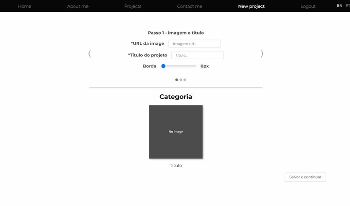
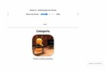
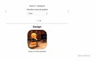
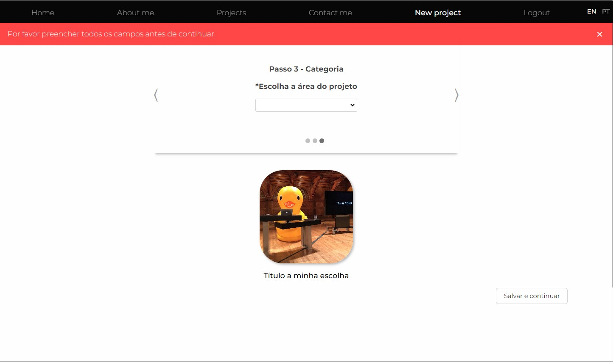
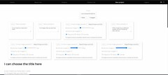
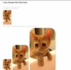

# Porfolio for an artist.

This is my final project for the course "CS50’s Web Programming with Python and JavaScript", and I made it thinking about a necessity of a friend of mine and a lot of artists around the globe.
This project is a personal portfolio for a Brazilian friend that can be constantly updated for a person that doesn't need to know how to code. All the pages that are visible only for the logged user are written in Portuguese, the "Home", "about me" and "contact me" pages have the english and portuguese version, that can be chosen at the navbar.
This is how a non logged user sees the navBar (image 1 is for desktop and 2 for mobile):

This is how a logged user sees the navBar (image 1 is for desktop and 2 for mobile):

This project is a single page app that uses pure JavaScript to change the page without actually reloads it. With a fast fade transition gives the user a great experience for the scenario changing, smoothly and not abrupt. 
This webapp allows the user to post new posts that can be part of 3 categories, Design, Painting and Sculpture. It's really simple to creat a new post I here you check a fast tutorial, everything is mobile responsive so the user don't have to worry about doing it only in the computer, but the demonstration bellow only shows the desktop version, the Youtube video will show both.

For the first part the user can choose the thumbnail image, by providing an image URL, border radius for the image from 0px to 50px, a title and a font weight.

1 - Initial view
2 - Step 1, Maximum border selected (just for an exemple), URL and title provided as well
3 - Step 2, selecting the font weight
4 - Step 3, selecting the category

Don't worry, if you forget something the error will tell so (message in portuguese).

Next step the user will be able to write the post inserting all the texts and images that he wants to. The user needs to provide the URL image, choose the border radius but now from 0px to 100px and the size **The image will be resized only if it have enough quality to*no one wants a 144p big image in a portfolio.
Right bellow it the user will have the preview of the post, to make it easier to know how it will look like after he posts it.

Tcharaam! Now you have it on the projects page, here you have a preview of the Design section of the Projects page (and a bunch of tests that I made)

## Distinctiveness and Complexity