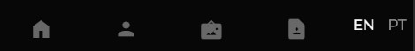
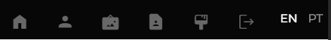
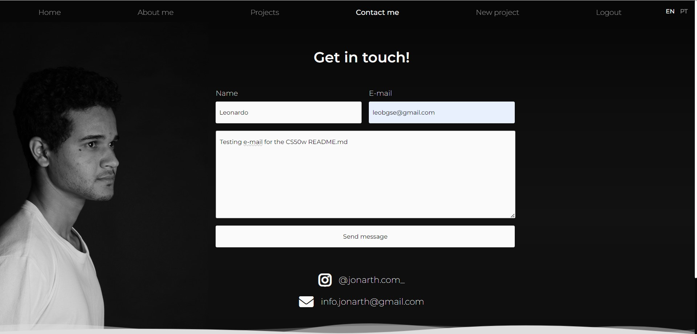
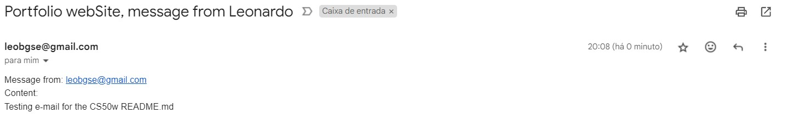
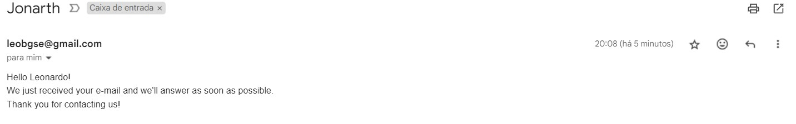

# Portfolio for an artist

This is my final project for the course "CS50’s Web Programming with Python and JavaScript", and I made it thinking about the necessity of a friend of mine and a lot of artists around the globe.
This project is a personal portfolio for a Brazilian friend that can be constantly updated for a person that doesn't need to know how to code. All the pages that are visible only for the logged user are written in Portuguese, the "Home", "about me" and "contact me" pages have the english and portuguese version, that can be chosen at the navbar.
This is how a non logged user sees the navBar (image 1 is for desktop and 2 for mobile):



This is how a logged user sees the navBar (image 1 is for desktop and 2 for mobile):



This project is a single page app that uses pure JavaScript to change the page without actually reloading it. With a fast fade transition, it gives the user a great experience for the scenario change, smoothly and not abrupt. 
This web app allows the user to post new posts that can be part of 3 categories, Design, Painting and Sculpture. It's really simple to creat a new post, everything is mobile responsive so the user doesn't have to worry about doing it only in the computer.

For the first part the user can choose the thumbnail image, by providing an image URL, select the border radius for the image from 0px to 50px, a title and a font weight.

Don't worry, if you forget something the error message will tell you so.

Next step the user will be able to write the post inserting all the texts and images that he wants to. The user needs to provide the URL image, choose the border radius but now from 0px to 100px and the size. **The image will be resized only if it has enough quality to*, no one wants a 144p big image in a portfolio.
Right below it, the user will have the preview of the post, to make it easier to know how it will look like after he posts it.

Tadaa! Now you have it on the projects page.

Everything above will be showed in the youtube video.

## Distinctiveness and Complexity

This project is different from the others, here I'm exploring the necessity of an artist to have a portfolio that can be constatly updated, by posting new projects from different categories. 
The user will be able not just to write a new post, but to style it as he needs to by choosing the border radius, image and title from the both parts of the post, thumbnail and project content.
While the user is creating the new post he will have the real time preview, every character written on the textarea will also appear on the post preview.

The user can add as many text or images as he wants to. The image has 3 sizes, small, medium and large, but it will only be resized if the quality of the image allows it, to keep the ratio and quality of it, otherwise the size does not change.
To have the possibility to log in you must create a super user in django database. I didn't create a register page to prevent someone without the permission to create a new account to create it, that's not the idea for the project, the idea is that only the person who owns the code can create users that can manipulate the website content.

To provide a better experience to the user I created a modern layout and a single page app using only javaScript, that was a real challenge. I organized my project almost like a React project, by components and rendering only one HTML file the `index.html`. The login page is a different file and can be accessed by the url /loginAuthor.
To make sure the user will have a great experience using the website I handled the previous and forward button, by setting the window.popstate and window.history. 

To change the URL without using an external library (like react router) I had to set the history.pushState and/or history.replace depending on the scenario.

Combining the Django views data and conditional render with JavaScript I was able to render the right page based on the data attribute, by sending the data from django as `{'pageToRender': "x"}` I can allocate it in a data attribute on main, like this:

`<main data-language="en" data-page-render="{{pageToRender}}">`

And in the main.js we have something like this:

`switch (main.dataset.pageRender)` 

That will run the most appropriate function for each scenario, it will be better explained on the right section of that README.md, where I'll explain file by file.
Then if the user changes the page by clicking on a navBar link it will change the data-page-render as well, to do it our navBarRedirect.js will handle it all.
First we'll apply the transition and change the `.active` class from the navbar item. 
After that the render page function will change the page content and if the main part of the page is black the scroll bar will be white, and if it's white the scroll bar will be black.

In the contact page you'll find a form to send an e-mail to the author, to get in touch with the Author.

For security reasons I'm not gonna let my password on gitHub. To make it work correctly you need to set those fields from the file finalproject/settings.py:
```
# Email Settings
EMAIL_HOST = 
EMAIL_HOST_USER =
EMAIL_HOST_PASSWORD = 
EMAIL_PORT = 
EMAIL_USE_TLS = 
```
Here we have an example:



When someone sends an e-mail that is what the author will receive:



Obs: please ignore the fact I'm sending it from me to myself, that's not a bug.

And that is the automatic message the site send to the person that sent the e-mail.



